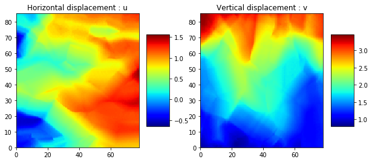
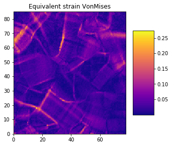

This documention is made from a jupyter notebook available in
'Exemple/Documentation.ipynb'

Load the data
=============

.. code:: ipython3

    import DICToolbox.dic as dic
    import matplotlib.pyplot as plt
    import matplotlib.cm as cm

.. code:: ipython3

    # Folder where output from 7D are
    adr='Data/7D-output/'
    # Resolution of the pixel. Information extracted from image used for the DIC
    res=0.0513 # mm/pixel You can chose the unity you want
    # time step between each picture
    time_step=150*60 # second here but you can choose the unity you want
    # microstructure picture
    # It sould be a black and white (boundary) image where the resolution is depending of the size of the correlation windows used in 7D.
    # Here n=p=10 in 7D
    micro='Data/micro_10.bmp'
    
    # Create Data object
    data=dic.dic(adr,res,time_step,adr_micro=micro)

Structure of the object
-----------------------

How many time step ?
~~~~~~~~~~~~~~~~~~~~

You can fin this information running this :

.. code:: ipython3

    print('Numbers of time step = '+str(len(data.strain)))

.. parsed-literal::

    Numbers of time step = 9

What are the data stored ?
~~~~~~~~~~~~~~~~~~~~~~~~~~

**Displacement field** : (u,v) for :math:`u\vec{x}+v\vec{y}`

**Strain Tensor** : strain

:math:`\mathbf{\omega_{xy}}` : oxy

**microstructure** : micro

**grains label** : grains

**time** : time

Plot the data
=============

For the time step 5

.. code:: ipython3

    t=5

Displacement
------------

.. code:: ipython3

    plt.figure(figsize=(10,5))
    plt.subplot(1,2,1)
    data.u[t].plot()
    plt.title('Horizontal displacement : u')
    plt.subplot(1,2,2)
    data.v[t].plot()
    plt.title('Vertical displacement : v')

.. parsed-literal::

    Text(0.5, 1.0, 'Vertical displacement : v')

Componante of strain tensor
---------------------------

.. code:: ipython3

    plt.figure(figsize=(15,5))
    plt.subplot(1,3,1)
    data.strain[t].t11.plot(colorbarcenter=True,colorbar=cm.seismic)
    plt.title('$\epsilon_{xx}$')
    plt.subplot(1,3,2)
    data.strain[t].t22.plot(colorbarcenter=True,colorbar=cm.seismic)
    plt.title('$\epsilon_{yy}$')
    plt.subplot(1,3,3)
    data.strain[t].t12.plot(colorbarcenter=True,colorbar=cm.seismic)
    plt.title('$\epsilon_{xy}$')

.. parsed-literal::

    /home/chauvet/anaconda3/lib/python3.7/site-packages/numpy/core/fromnumeric.py:83: RuntimeWarning: invalid value encountered in reduce
      return ufunc.reduce(obj, axis, dtype, out, **passkwargs)

.. parsed-literal::

    Text(0.5, 1.0, '$\\epsilon_{xy}$')

.. image:: output_11_2.png

Solid rotation
--------------

.. code:: ipython3

    plt.figure(figsize=(5,5))
    data.oxy[t].plot(colorbarcenter=True,colorbar=cm.seismic)
    plt.title('$\omega_{xy}$')

.. parsed-literal::

    Text(0.5, 1.0, '$\\omega_{xy}$')

.. image:: output_13_1.png

Equivalent strain
-----------------

VonMises equivalent strain field :
:math:`\sqrt{\frac{2}{3}\left( \varepsilon_{xx}^2+\varepsilon_{yy}^2+2.\varepsilon_{xy}^2 \right) }`

.. code:: ipython3

    plt.figure(figsize=(5,5))
    data.strain[t].eqVonMises().plot(colorbar=cm.plasma)
    plt.title('Equivalent strain VonMises')

.. parsed-literal::

    Text(0.5, 1.0, 'Equivalent strain VonMises')

.. code:: ipython3

    ## Add microstructure on figure

.. code:: ipython3

    plt.figure(figsize=(5,5))
    data.strain[t].eqVonMises().plot(colorbar=cm.plasma)
    data.micro.plotBoundary(dilatation=1)
    plt.title('Equivalent strain VonMises + Grains boundries')

.. parsed-literal::

    Text(0.5, 1.0, 'Equivalent strain VonMises + Grains boundries')

.. image:: output_17_1.png

Plot principal direction of the strain tensor
---------------------------------------------

.. code:: ipython3

    plt.figure(figsize=(15,15))
    data.strain[t].principal_tensor(scale=50,space=3,twod=True,absolutemax=True)
    data.micro.plotBoundary()
    plt.axis('off')

.. parsed-literal::

    (0.0, 77.976, 0.0, 85.158)

.. image:: output_19_1.png

Extract macroscopic curve
=========================

.. code:: ipython3

    time,macro_eyy,macro_line=data.strain_macro(nb_line=3)

.. code:: ipython3

    plt.figure(figsize=(8,5))
    plt.plot(time/3600.,macro_eyy,'b',label='$<\epsilon_{yy}>$')
    plt.plot(time/3600.,macro_line,'r',label='Dic-ligne')
    plt.grid('on')
    plt.legend()
    plt.xlabel('Time (hours)')
    plt.ylabel('Macro strain')

.. parsed-literal::

    /home/chauvet/anaconda3/lib/python3.7/site-packages/matplotlib/cbook/__init__.py:424: MatplotlibDeprecationWarning: 
    Passing one of 'on', 'true', 'off', 'false' as a boolean is deprecated; use an actual boolean (True/False) instead.
      warn_deprecated("2.2", "Passing one of 'on', 'true', 'off', 'false' as a "

.. parsed-literal::

    Text(0, 0.5, 'Macro strain')

.. image:: output_22_2.png

